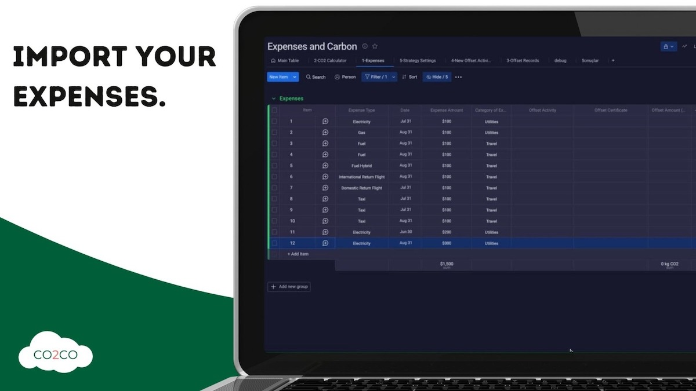
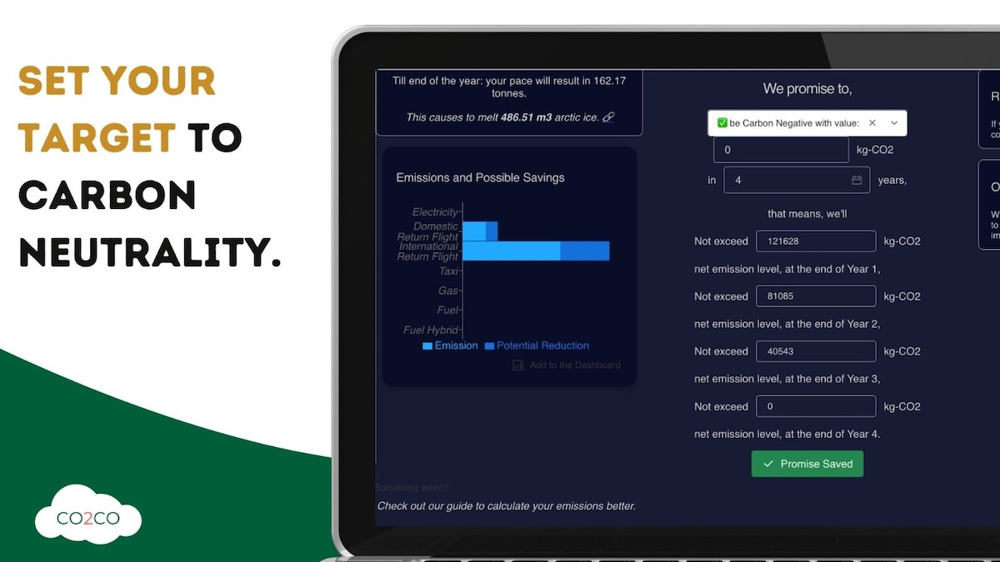
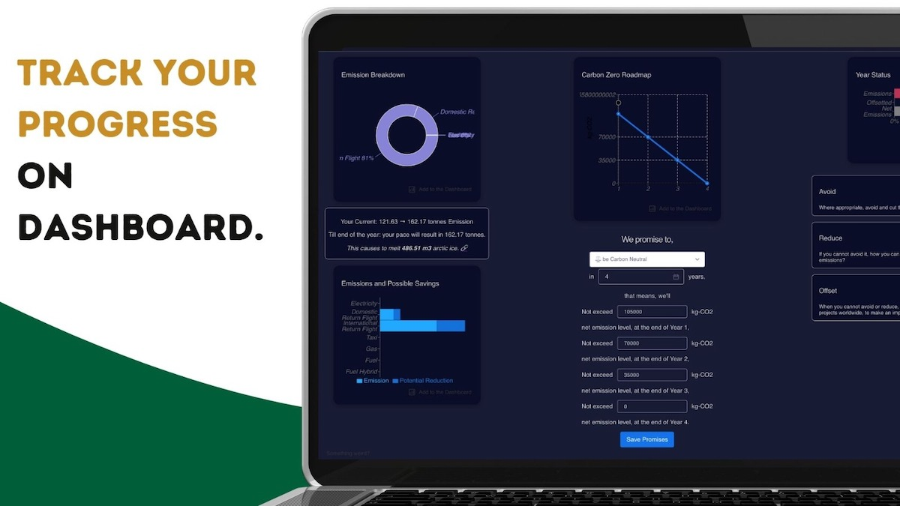

# co2counter - A Monday.com Carbon Emission Strategy Helper Application

## What it does?

co2co is a tool to calculate the carbon footprint of your expenses by using monday.com's end-to-end work os capability.
It is fully customizable to reflect reality more. Carbon footprint calculation is only one step that most calculators
accept this step enough; after footprint, co2co help you to draw a strategy to reduce your net emissions and set
targets. It has widgets to monitor the company status available to all colleagues continuously.

### Features
1. Easy; only connect your expense record
1. Configurable carbon emission calculation
1. Carbon offset certificate support
1. 100% data ownership: all of your data stays in monday
1. 3 widgets to visualize the path
1. net-zero roadmap (graph): notice that whether if you're on track or not for the future targets
1. year target (graph): keep the status of the annual target
1. facts and inspiration: a curation of facts and example strategies
1. Dark mode support
1. Ready for Bigger Scale: Data storage and retrieval system is designed to handle biger data amounts.

## Ho to Use?

1. Install co2co app from Monday.com store. (Click to the "Add to Monday" button above.)
1. Create an expense table on Monday.com, which includes carbon calculator and offset policies groups too. (Check out this [template file](./assets/carbon_expenses_template.xlsx) to create forms.)
1. The excel file, contains 3 sections;
    1. CO2 Calculator: this group keeps unit emission amount per GBP / USD for each expense types. Expense Type and CO2/Unit - Expense field are used to convert expenses to footprint.
    1. Offset Records: This group is designeed to keep your carbon offsetting activities, Offset Activity, Offset Certificate and Offset Amount (KG) fields are important to calculate your offset.
    1. Expenses: your expense records, expense type and expense amount is mandatory to calculate footprint.

## How to Run Locally?

This repo contains 3 branches for the widgets `NetZeroRoadmap`, `FactsWidget`, `YearOverviewWidget` and `main` branch
for the main application. The builds of these 4 apps/features is available in the `/builds` folder.

If you want to build apps, you can change checkout to that branch and use the latest commits, and follow the path below;

- `npm i` : to install requirement of this project
- `npm start run` : opens a local development environment, you should provide a token inside the app for simulating data
relations
- `npm run build` : builds the app to deploy as a zip file to the monday platform
- `ngrok http 3000` : is the easiest way to run your local changes in a public environment, recommended to test on
monday.com